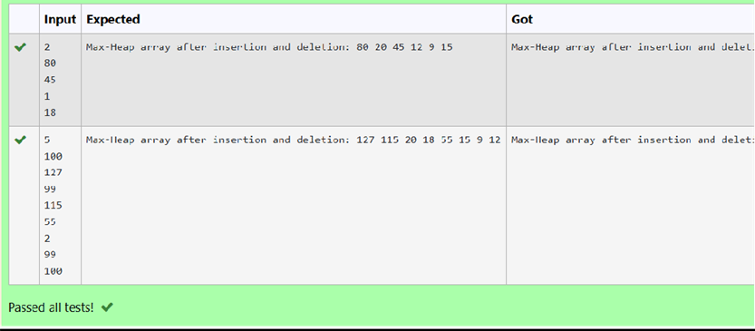

# Ex2b Priority Queue
## DATE: 03-03-2025
## AIM:
To formulate the C code to display the elements of the priority queue after insertion and deletion operation.

## Algorithm
1.	Start
2.	Define a function printArray() that takes an array and its size as parameters.
3.	Loop through the array from index 0 to size-1.
4.	Print each element of the array during the loop.
5.	After printing all elements, print a newline for formatting.
6.	End

## Program:
```
/*
Program to o display the elements of the priority queue after insertion and deletion operation
Developed by: Sethukkarasi C
RegisterNumber:  212223230201
*/
```

```
#include<stdio.h> 
int size = 0;
voidprintArray(int array[], int size)
{
    int i; 
    for(i=0;i<size;i++)
    {
        printf("%d ",array[i]);
    }
    printf("\n");
}

```

## Output:



## Result:
Thus, the C program to display the elements of the priority queue after insertion and deletion operation is implemented successfully
